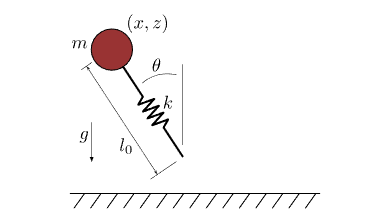

full state:
$$
x=\left [\begin{matrix}
x\\
z\\
\dot{x}\\
\dot{z}\\
\theta\\
\dot{r}\\
\dot{\theta}
\end{matrix}\right ]
$$

flight phase state:
$$
x=\left [\begin{matrix}
x\\
z\\
\dot{x}\\
\dot{z}\\
\end{matrix}\right ]
$$
stance phase state:
$$
x=\left [ \begin{matrix}r\\
\theta\\
\dot{r}\\
\dot{\theta}\end{matrix}\right]
$$
flight phase dynamics:
$$
\frac{d}{dt}x=\left[\begin{matrix}\dot{x}\\
\dot{z}\\
0\\
-g\end{matrix} \right]
$$

$$
r=l_0,\theta=u,\dot{r}=0,\dot{\theta}=0
$$

stance phase dynamics:
$$
\frac{d}{dt}x=\left[ \begin{matrix}\dot{r}\\
\dot{\theta}\\
\frac{k(l_0-r)-mgcos\theta+mr\dot{\theta}^2}{m}\\
\frac{-2r\dot{r}\dot{\theta}+grsin\theta}{r^2}\end{matrix}\right]
$$

$$
foot_x=x_0+sin\theta l_0\\
x=-rsin\theta+foot_x\\
z=rcos\theta\\
\dot{x}=-\dot{r}sin\theta -r\dot{\theta}cos\theta\\
\dot{z}=\dot{r}cos\theta-r\dot{\theta}sin\theta
$$

flight->stance:
$$
r=l_0\\
\theta=u\\
\dot{r}=-sin\theta \dot{x}+cos\theta \dot{z}\\
\dot{\theta}=-\frac{1}{l_0}(cos\theta\dot{x}+sin\theta\dot{z})
$$
stance->flight(ignore)

raibert style controller:

neutral point front the foot:

$$
sum_{vel}=\sum(\dot{x}-\dot{x}_d)\\
x_f=\frac{\dot{x}T_s}{2}+k_d(\dot{x}-\dot{x}_d)+k_isum_{vel}
$$
Ts is stance time 

control input:
$$
u=asin(x_f/l_0)
$$
